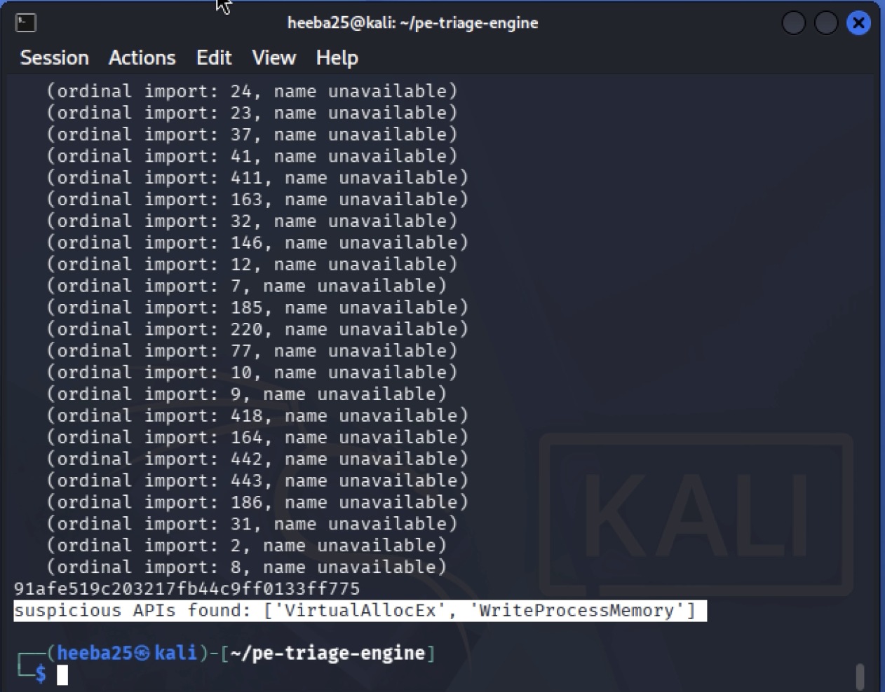

# PE Triage Engine

A static malware triage tool for Windows PE (Portable Executable) files, built entirely from scratch using Python's `struct` module with no `pefile` or other PE-parsing libraries. The goal is byte-level understanding of the PE format.

## What it does

`triage.py` reads a `.exe` file's raw bytes (never executes it) and extracts:

- **DOS and NT headers** — signature validation, machine type, section count, build timestamp
- **Optional Header** — entry point address, section table location
- **Section Table** — name, size, and **Shannon entropy** per section (flags packed/encrypted content)
- **Import Table** — every DLL and function imported, walked manually via the Import Lookup Table
- **ImpHash** — MD5 fingerprint of the ordered import list, matching the industry-standard (Mandiant) algorithm
- **Suspicious API flagging** — checks imports against a list of functions commonly abused for process injection

## Usage

```bash
python3 triage.py <path-to-pe-file>
```

## Environment

Built and tested inside an isolated Kali Linux VM (host-only networking, no internet access to the guest by default), following standard malware-analysis lab discipline:

- Network adapter set to Host-Only/Internal — never Bridged with live internet access while a sample is present
- Snapshots taken before any sample is introduced (`clean-baseline`) and after each verified sample acquisition
- Samples sourced only from MalwareBazaar (abuse.ch), downloaded as password-protected zips, hash-verified against the published SHA256 before any analysis
- Network briefly re-enabled only for specific tasks (installing tools, `git pull`/`push`), then immediately reverted to isolated mode

This project is **static analysis only** — no sample is ever executed.

## Design notes worth knowing

A couple of PE-format quirks came up repeatedly during the build and are worth understanding if you're reading the code:

- **RVA vs. file offset**: PE headers reference locations as RVAs (relative virtual addresses — positions once loaded into memory), not raw file offsets. `rva_to_offset()` converts between the two using the Section Table's mapping of virtual address ranges to on-disk positions.
- **Architecture-dependent layouts**: the Optional Header's size differs between PE32 (32-bit) and PE32+ (64-bit) binaries, and Import Table "thunk" entries are 4 bytes on x86 vs. 8 bytes on x64, with the ordinal flag bit at a different position accordingly. Both are read dynamically from the file rather than hardcoded — an earlier version hardcoded x64 sizing and silently broke on a 32-bit test binary.

## Validation

Tested against two known-clean binaries before any malware analysis:

| Sample | Architecture | Sections | ImpHash |
|---|---|---|---|
| PuTTY | x64 | 10 | `919bf235bf408d787826e503e9ed15b2` |
| 7-Zip | x86 | 4 | `7dd8959cdf32994d8e5915ee95fd915f` |

## Malware Teardown: Formbook (Two-Stage Sample)

Two related samples were analyzed to build a real dropper-vs-payload comparison.

### Sample 1 — Dropper

- **SHA256**: `89e3278b4afa50ac135ccc101ee85abe02ef3d1150d8c270eb9936f45b29e7c6`
- **Source**: MalwareBazaar (filename: `Oferty CZ1083377236U.xls`, originally delivered as an Excel-disguised email attachment)
- **Sections**: 5 — no individual section entropy above 6.46; whole-file entropy 7.92
- **Imports**: ~140 functions across `KERNEL32`, `USER32`, `GDI32`, `SHELL32`, `ADVAPI32`, `COMCTL32`, `ole32` — predominantly file/directory management, registry access, and window-drawing calls, consistent with a generic software installer
- **Suspicious API hits**: none
- **ImpHash**: `519514481f0eb0f412649acf768564dd`

**Interpretation**: this sample's import profile closely resembles a standard NSIS/InstallShield-style installer, not a stealer. Cross-referencing MalwareBazaar's vendor threat intelligence confirmed this file is Formbook's **dropper stage** — its role is to deliver and execute the real payload, not to perform data theft itself. The unremarkable, installer-like appearance is a deliberate evasion property of droppers generally, not a limitation of this tool. A dropper's own capability, absent the payload it delivers, is limited to file/registry manipulation typical of an installer — the actual damaging behavior only manifests once the payload stage executes.

No distinctive, non-generic import combination could be identified for this sample (registry access, GUI, and COM usage are all standard in legitimate installers), so it was not used as the basis for a YARA rule.

### Sample 2 — Payload

- **SHA256**: `337463b61d271e4826a1c570e565fe58f42548247b20c9cc8d52e7342943606e`
- **Source**: MalwareBazaar (filename: `pedir pdf.exe`)
- **Sections**: 6, including **two sections both named `.text`** — confirmed independently via `pefile` (not a parsing bug):

- .text VA=0x1000 size=0x8e000 entropy=6.68
- .rdata VA=0x8f000 size=0x2fe00 entropy=5.76
- .data VA=0xbf000 size=0x5200 entropy=1.20
- .rsrc VA=0xc8000 size=0xaae00 entropy=7.55
- .reloc VA=0x173000 size=0x7200 entropy=6.78
- .text VA=0x17b000 size=0x1b000 entropy=7.87 ← entry point lands here




- **Entry point**: `0x17b000` — sitting inside the **second**, smaller `.text` section (entropy 7.87/8.0, near-maximum randomness), not the compiler-generated first `.text` section
- **Imports**: ~400+ functions across 17 DLLs, including `WININET.dll`, `WSOCK32.dll`, `IPHLPAPI.dll` (networking) and `ADVAPI32.dll` token/privilege functions
- **Suspicious API hits**: `VirtualAllocEx`, `WriteProcessMemory`
- **ImpHash**: `91afe519c203217fb44c9ff0133ff775`

**Interpretation**: execution begins not in the normal compiled code section, but in a second, duplicate-named `.text` section with entropy at the near-maximum of the 0–8 scale — a strong, independently-verified indicator of packed or injected code executed at runtime. This is corroborated by MalwareBazaar's vendor behavior report for this sample, which documents process hollowing, thread context modification, and memory mapping into another process — matching the `VirtualAllocEx`/`WriteProcessMemory` combination this tool flagged. Unlike the dropper, this sample's import list is large and network/injection-capable, consistent with Formbook's actual stealer functionality.

### Dropper vs. Payload comparison

| | Dropper | Payload |
|---|---|---|
| Imports | ~140, installer-typical | ~400+, network + injection-capable |
| Suspicious APIs flagged | none | `VirtualAllocEx`, `WriteProcessMemory` |
| Max section entropy | 6.46 | 7.87 (in duplicate `.text`) |
| Entry point location | first section | duplicate, high-entropy `.text` |
| Role | delivery/installer | stealer/injection |

### Bugs found and fixed during this analysis

Both were caught by verifying against MalwareBazaar's published ImpHash for the payload sample, rather than trusting the tool's output blindly:

1. **Ordinal imports silently dropped from ImpHash input.** Imports referenced by ordinal number (rather than by name) were printed but never added to the hash input list, producing an incomplete — and therefore incorrect — fingerprint. Fixed by extracting the ordinal number and encoding it as `dllname.ordN`, matching the standard algorithm.
2. **DLL names not stripped of file extension before hashing.** The standard ImpHash algorithm (per Mandiant's original methodology) removes file extensions (`.dll`, `.ocx`, `.sys`) from DLL names before hashing; this tool was including them, producing a different string input and therefore a different hash. Fixed with an extension-stripping step applied specifically to the hash-input value (display output retains the full name).

After both fixes, the payload's computed ImpHash (`91afe519c203217fb44c9ff0133ff775`) matched MalwareBazaar's published value exactly.

## YARA Rule

`rules/formbook_payload.yar` — targets the **payload** sample specifically.

```yara
import "pe"

rule Formbook_Payload_Injection_Indicators
{
    meta:
        author = "Heeba"
        description = "Detects Formbook-style payload via process injection API combo and duplicate .text section anomaly"
        date = "2026-09-14"
        reference = "SHA256: 337463b61d271e4826a1c570e565fe58f42548247b20c9cc8d52e7342943606e"

    condition:
        pe.imports("KERNEL32.dll", "VirtualAllocEx") and
        pe.imports("KERNEL32.dll", "WriteProcessMemory") and
        pe.number_of_sections >= 2 and
        for any i in (0..pe.number_of_sections - 1) : (
            for any j in (i+1..pe.number_of_sections - 1) : (
                pe.sections[i].name == pe.sections[j].name
            )
        )
}
```

**Design decision — why one rule, not one covering both samples**: the dropper and payload share no genuinely distinctive structural or behavioral trait beyond both being part of the same delivery campaign (confirmed via MalwareBazaar, not via any shared static trait this tool found). Forcing a single rule to cover both would mean either using a very loose `OR` of two unrelated condition sets — not a real unified signature — or keying on ImpHash, which is exact-match brittle and breaks on recompilation. The dropper's own import profile (registry access, COM usage, GUI calls) is standard installer behavior, indistinguishable from countless legitimate installers, and was judged not distinctive enough to form a defensible rule. The rule above targets only the payload, using the two verified, behaviorally-meaningful traits found during teardown: the injection API combination and the duplicate-section-name anomaly.

**Testing results** (using `yara-python`, since standalone `yara` CLI was unavailable in the offline testing environment):

| File | Match |
|---|---|
| Formbook payload (337463b6...) |  Matched |
| Formbook dropper (89e3278b...) |  No match |
| PuTTY (clean) |  No match |
| 7-Zip (clean) |  No match |

Correctly identifies the payload while producing no false positives against the dropper or either known-clean binary.

## References

Blogs and write-ups consulted while building this tool, alongside the official Microsoft PE format spec:

- [0xRick's PE Internals series](https://0xrick.github.io) — used for understanding most core PE structures, roughly through Week 4 of the build (headers, sections, imports)
- [Anatomy of the Portable Executable Format — deephacking.tech](https://blog.deephacking.tech/en/posts/anatomy-of-the-portable-executable-format/) — reference for Import Table structure and walking imports
- [Cocomelonc's blog](https://cocomelonc.github.io) — reference for entry point analysis; also implements Shannon entropy calculation for section analysis, useful for comparing approaches
- [Converting RVA to File Offset and Back — tech-juice.org](https://tech-juice.org/2011/02/21/portable-executable-converting-rva-to-file-offset-and-back) — reference for the RVA-to-file-offset conversion logic used in `rva_to_offset()`

